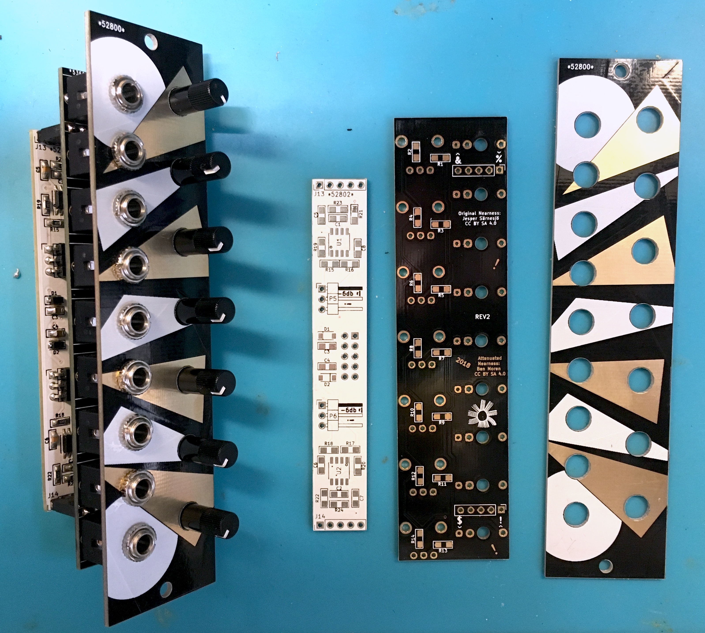

# Attenuated nearness
##### (aka. *52800*)
## Nearness with attenuators for each input

The idea is to have some number of input jacks (seven, here) mixed down to two output jacks, with each input representing a fixed pan position somewhere between the two extremes represented by the outputs. Plug a signal into the topmost input to send it entirely to the top output, the middle one to send it equally to both, etc.

Attenuated nearness builds on this original idea by adding a per input attenuator. This should give more flexibility in using this as a final or only mixing stage in small systems.

More info in this discussion on llllllll.co:
https://llllllll.co/t/prototyping-nearness-a-minimal-panning-mixer-module/8330

Original Nearness Repo: https://github.com/sarnesjo/nearness

## Build guide
1. Start with the surface-mount components. Mind the orientation of the ICs and diodes. (I like to do the whole backpack board first then the jack/pot board)
1. Solder the pin headers to join the 2 boards. (Be mindful of the socket/pin relationship if you are upgrading from a stock nearness.)
1. Place the jacks & pots on the PCB.
1. Screw on the panel, then solder jacks and pots.

## BOM
<a href="nearness_att_bom.csv">Build of Materials</a>

Mouser Project Link:	https://www.mouser.com/ProjectManager/ProjectDetail.aspx?AccessID=e1ea3fb0a7

## License
[CC BY-SA 4.0](http://creativecommons.org/licenses/by-sa/4.0/)
